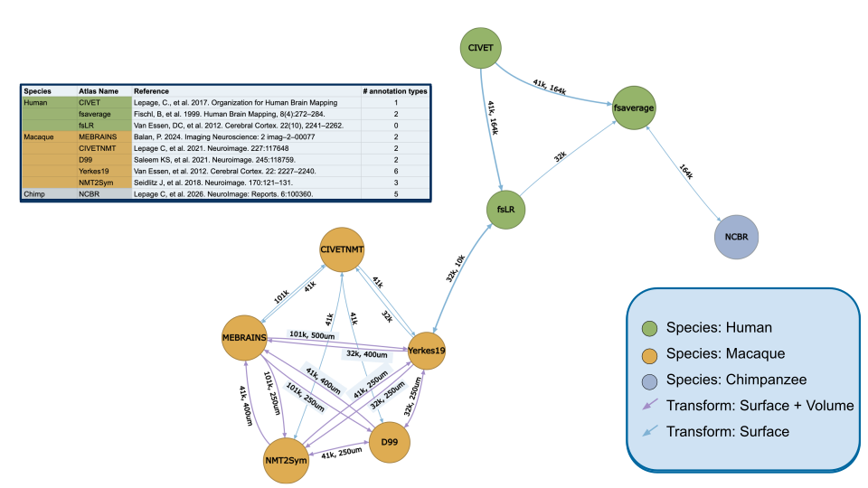

# Neuromaps-PRIME 

[](https://github.com/childmindresearch/neuromaps-prime/actions/workflows/test.yaml?query=branch%3Amain)
[](https://github.com/astral-sh/ruff)
[](https://github.com/childmindresearch/neuromaps-prime/blob/main/LICENSE)
[](https://childmindresearch.github.io/neuromaps-prime)

> [!Important]
> This project is currently in active development. The API is subject to breaking
> changes without notice.

The `neuromaps-prime` toolbox integrates multiscale, multimodal annotations across NHP
brains, enabling comprehensive comparative analyses of brain organization. This package
extends the neuromaps ecosystem to provide unified access to diverse NHP brain datasets
and specialized tools for NHP-specific analyses.

## Features

- Robust transformation between NHP spaces (Yerkes19, NMT2, CIVETNMT, D99, MEBRAINS)
- Cross-species transformation between NHP and human (Yerkes19, fsLR)

## Data

Data currently included in the Neuromaps-PRIME graph:


## Installation

To install the latest stable release version from PyPI, run:

```sh
pip install neuromaps-prime
```

Alternatively, if you want to use the newest development version, you can install it
directly from the repository via:


```sh
pip install git+https://github.com/childmindresearch/neuromaps-prime
```

## Examples

See the [`examples/`](examples/) directory for sample scripts:

- [`example_graph_init.py`](examples/example_graph_init.py) — graph inspection and plotting
- [`example_surface_transform.py`](examples/example_surface_transform.py) — surface-to-surface resampling and surface-to-volume projection
- [`example_volume_transform.py`](examples/example_volume_transform.py) — volume-to-volume warping and volume-to-surface projection
- [`example_plot_interactive_graph.py`](examples/example_plot_interactive_graph.py) - generating an interactive HTML plot of the graph

